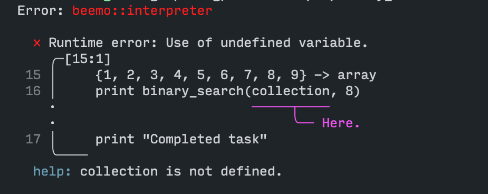

# Beemo

Unremarkable Python-inspired programming language with remarkably good errors.

## Grammar

Read [GRAMMAR.md](GRAMMAR.md)

## Background

This language is an experiment in the design of an interpreter with extremely empathetic feedback. The goal is to become a language that is learnable solely from error messages.

## Feel

```
binary_search(array, num):
	0 -> lo
	8 -> hi
	while lo <= hi:
		lo + (hi - lo) / 2 -> mid
		if array[mid] == num:
			return mid
		if array[mid] > num:
			mid -> hi
		if array[mid] < num:
			mid + 1 -> lo

main:
	{1, 2, 3, 4, 5, 6, 7, 8, 9} -> array
	print binary_search(array, 8)
```

## Usage

* `git clone` this repository
* `cargo run -q examples/[example_name].bmo`

## Error examples





